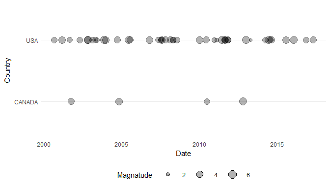

QuakeCoursera is a package developed as the capstone project for the
Advanced R Programming specialization on
[Coursera](http://www.coursera.org). It exists to help clean and
visualize data from the [NOAA Significant Earthquake
Database](https://www.ngdc.noaa.gov/nndc/struts/form?t=101650&s=1&d=1)

This document serves as an introduction to the package and demonstrates
how to use each of the individual features.

This document is organized into three broad categores, as follows:

1.  [Getting and Cleaning the Data](#data)  
2.  [Timeline Visualization](#timeline)  
3.  [Interactive Mapping](#mapping)

Getting and Cleaning the Data
-----------------------------

The [NOAA Significant Earthquake
Database](https://www.ngdc.noaa.gov/nndc/struts/form?t=101650&s=1&d=1)
is an amazing resource. It has information on earthquakes that have
occurred worldwide over more than 4000 years. However as a raw text
file, it isn't the easist to work with.

Some cleaning is required to get the data ready to work nicely with the
visualization functions provided below. The easist thing to do is simply
to load the clean dataset included with this package using the `data()`
function:

    data('clean_NOAA')

The drawback with this approach is that the included dataset has been
frozen as of the date of the download for creation of this package, July
1 2017. You can download the most recent dataset yourself
[here](https://www.ngdc.noaa.gov/nndc/struts/results?type_0=Exact&query_0=$ID&t=101650&s=13&d=189&dfn=signif.txt)
and clean it using the `eq_clean_data()` function. Assuming you have
downloaded the raw data to your working directory as 'signif.txt':

    clean_NOAA <- readr::read_delim('signif.txt',delim = '\t') %>%
        eq_clean_data()

Eather way, `clean_NOAA` is now ready to be used for visualizing the
historical earthquake data.

### Unexported Helper Functions

To minimize cluttering the namespace of the user, only the most likely
to be used functions are exported and easily available. However, several
helper functions are included which can be accessed directly using the
`:::` operator.

`eq_good_date()` Takes year, month, and day as integer input and returns
a valid date object. Negative years are interpreted as BCE dates.

    QuakeCoursera:::eq_good_date(2017, 7, 11)
    #> [1] "2017-07-11"
    QuakeCoursera:::eq_good_date(-2000, 1, 1)
    #> [1] "-2000-01-01"

It should be noted that R date objects do not handle BCE dates very
well, and date differences between BCE and CE will be off by a year, as
R date objects behave as if a year 0 exists, when in fact 1 CE began
immediately after 1 BCE concluded.

`eq_location_clean()` Takes a string input, strips out everything before
a ':' character, converts the remainder to Title Case, and cleans up
comma formats. This is useful as the LOCATION\_NAME field in the raw
data duplicates the data in COUNTRY (always before a colon) and makes
the rest attractive for use as a label.

    QuakeCoursera:::eq_location_clean("USA:  sAn francisco")
    #> [1] "San Francisco"

`title_case()` Converts any string to title case. What is title case?
'This Is Title Case'. 'this is not title case'.

    QuakeCoursera:::title_case('this is now title case')
    #> [1] "This Is Now Title Case"
    QuakeCoursera:::title_case('THIS IS NOW TITLE CASE TOO')
    #> [1] "This Is Now Title Case Too"

Timeline Visualization
----------------------

A timeline is a great way to see when significant earthquakes have
ocurred. This package includes a custom `geom` and `stat` to make
creating just such a plot easier with the widely-used `ggplot2` package.

`geom_timeline()` takes, at minimum, a series of dates as its `x`
aesthetic, and plots those dates as a series of circles. It defaults to
using `stat_timeline()` for data transfomation, which allows `x_min` and
`x_max` arguments to be passed to limit the date range to be plotted. In
its simplest form:

    filter(clean_NOAA, COUNTRY == "USA") %>% ggplot(aes(x = DATE)) + 
        geom_timeline(x_min = ymd("2000-01-01"), x_max = ymd("2017-07-01")) +
        theme_minimal() + theme(panel.grid.major.x = element_blank()) +
        theme(axis.text.y  = element_blank()) +
        theme(panel.grid.minor.x = element_blank()) +
        scale_y_continuous(breaks = 1, limits = c(0.5, 2)) +
        labs(x = "Date")

Adding in optional `y` and `size` aesthetics make the visualization even
more powerful--we can compare the magnatude of earthquakes among
countries during the same period, for exxample:

    filter(clean_NOAA, COUNTRY == "USA" | COUNTRY == "CANADA") %>% 
        ggplot(aes(x = DATE, y = COUNTRY, size = EQ_PRIMARY)) + 
        geom_timeline(x_min = ymd("2000-01-01"), x_max = ymd("2017-07-01")) +
        theme_minimal() + theme(panel.grid.major.x = element_blank()) +
        theme(panel.grid.minor.x = element_blank()) + theme(legend.position = "bottom") +
        theme(legend.key.size = unit(0.078, 'npc')) +
        labs(x = "Date", y = "Country", size = "Magnatude")

This package also has a Geom and Stat pair to allow easy labeling of the
occurrences plotted on the timeline--`geom_timeline_label()` and
`stat_timeline_label()`. Once again the Stat is called by default within
the geom, so there is no need to demonstrate the Stat. The Geom requires
a `label` aesthetic, the text for the labels to be added. It also adds
an additional optional `magnatidue` aesthetic which, when combined with
the optional `top_x_mag` argument limits the total labels shown by order
of `magnatude`. So, extending the above:

    xmin <- ymd("2000-01-01")
    xmax <- ymd("2017-07-01")
    filter(clean_NOAA, COUNTRY == "CANADA" | COUNTRY == "USA") %>% 
        ggplot(aes(x = DATE, y = COUNTRY, size = EQ_PRIMARY)) + 
        geom_timeline(x_min = xmin, x_max = xmax) +
        geom_timeline_label(aes(label = LOCATION_NAME, magnatude = EQ_PRIMARY),
                            x_min = xmin, x_max = xmax, top_x_mag = 5) +
        theme_minimal() + theme(panel.grid.major.x = element_blank()) +
        theme(panel.grid.minor.x = element_blank()) + theme(legend.position = "bottom") +
        theme(legend.key.size = unit(0.078, 'npc')) +
        labs(x = "Date", y = "Country", size = "Magnatude") 

Interactive Mapping
-------------------

 The final component to this package is an easy
shortcut for creating an interactive map of earthquake locations using
the popular `leaflet` package. The function for doing so is `eq_map()`,
which by default plots the events by `LATITUDE` or `LONGITUDE` found in
the `data` argument as circles, with the magnatude of the earthquake as
found in `EQ_PRIMARY` as the size of the circles. An optional
`annot_col` argument allows labeling the locations (the label comes up
when the circle is clicked). For example:

    mp <- clean_NOAA %>% filter(year(DATE) >= 2000 & COUNTRY == "MEXICO") %>%
        eq_map(annot_col = "DATE")

    mp

<!--html_preserve-->

<!--/html_preserve-->
Since no single column in the data is an ideal label, the function
`eq_create_label()` combines the data in `LOCATION_NAME`, `EQ_PRIMARY`,
and `TOTAL_DEATHS` into a single column, as well as adding html
formatting for a nice display. Once again, click the circles to see the
labels:

    mp <- clean_NOAA %>% filter(year(DATE) >= 2000 & COUNTRY == "MEXICO") %>%
        mutate(popup_text = eq_create_label(.)) %>% 
        eq_map(annot_col = "popup_text")

    mp

<!--html_preserve-->

<!--/html_preserve-->
